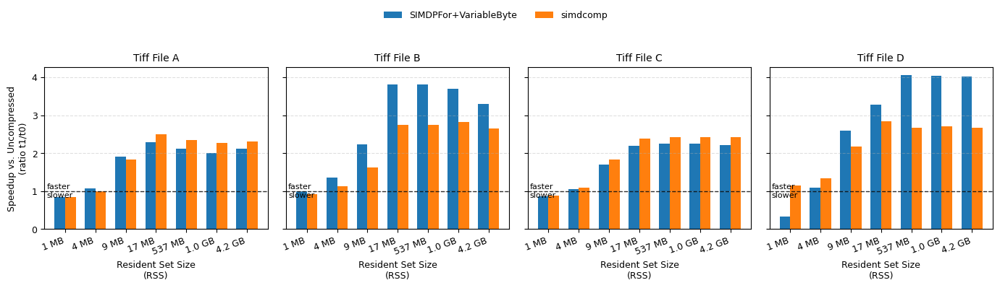

## Compressive Streaming for Geospatial Pipelines

Beating main-memory bandwidths in geospatial pipelines with fast in-memory compression.

[**Download Report**](https://raw.githubusercontent.com/omarathon/compression-geospatial/main/report.pdf)

### Latest results

The fused compressors have been upgraded to remove redundant stores. Now, we achieve up to **4x speedups**:

### Files

`codecs/*`: core codecs implementing the `codecs/generic_codecs.h` inteface

Main programs:
* `test_comp.cpp`: test codecs
* `bench_comp.cpp`: benchmark codecs
* `bench_pipeline.cpp`: benchmark geospatial pipelines

Additional files:
* `codec_collection.h`: bundled codecs
* `test_remappings.cpp`: verifies Morton remappings
* `util.h`, `transformations.h`, `remappings.h`: CPP utilities
* `py/*`: Python utilities
* `sh/*`: Shell performance-monitoring utilities

### Setup (Basic)
We assume a Linux environment.
1. install these packages with `apt-get` (you might need more, debug appropriately)
    1. `g++`, `g++-11`, `libgdal-dev`, `python3-gdal`, `liblz4-dev`, `libzstd-dev`, `zlib1g-dev`, `liblzma-dev`
1. obtain the submodules in `external` and build them
2. `make`

### Setup (Fusing Summing into Decompression)
1. re-build `external/FastPFor` and `external/simdcomp` from these forks:
    1. FastPFor: https://github.com/omarathon/FastPFor
    1. simdcomp: https://github.com/omarathon/simdcomp
1. replace `codecs/custom_vec_logic_codecs.h` with `agg/custom_vec_logic_codecs.h` (the new file contains the modification to the `custom_rle_vecavx512` codec which fuses summing into decompression)
1. replace `codecs/simdcomp_codecs.h` with `agg/simdcomp_codecs.h` (same as ^)
1. replace `bench_pipeline.cpp` with `agg/bench_pipeline.cpp`
1. `make clean && make`

### Setup (Running on HPC)
1. `source hpc/modules.sh`
2. replace `Makefile` with `hpc/Makefile` (the new Makefile contains compiler modifications for the HPC)
3. `make`

### Misc

Licence:
* MIT for all files in `codecs`, except the TurboPFor wrapper (`codecs/turbopfor_codecs.h`), LZ4 wrapper (`codecs/lz4_codecs.h`) and 2ibench wrapper (`codecs/2ibench_codecs.h`) which are GPL.
* GPL for everything else.

Full repo/data/report on request
