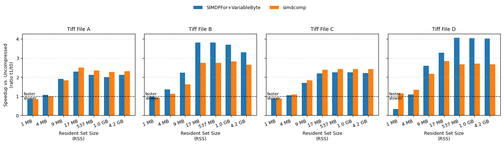

## Compressive Streaming for Geospatial Pipelines

Beating main-memory bandwidths in geospatial pipelines with fast in-memory compression.

[**Download Report**](https://raw.githubusercontent.com/omarathon/compression-geospatial/main/report.pdf)

### Latest results

The fused compressors have been upgraded to remove redundant stores. Now, we achieve up to **4x speedups**:



### Fusion experiments (in progress)

SIMDPFor sum fusion optimisations investigation (varying branching and cache-locality trade-offs):

[**Google doc**](https://docs.google.com/document/d/1fZs7e5HcAdol82Xmwtj-q9u0QLf70hxAw0Cxfvb9NmM/edit?usp=sharing)

### Files

`src/codecs/generic/*`: base codec interfaces (`StatefulIntegerCodec`, `CompositeStatefulIntegerCodec`, `DirectAccessCodec`)

`src/codecs/int32/*`: codec implementations for `int32_t` data

`src/codecs/int32/codec_collection.h`: bundled codec registry (`InitCodecs`)

Main programs:
* `bench/bench_comp.cpp`: benchmark codecs (compression ratio and speed)
* `bench/bench_pipeline.cpp`: benchmark geospatial pipelines (decode + access transformation)
* `tests/test_int32_codecs.cpp`: test int32 codecs
* `tests/test_remappings.cpp`: verifies Morton and zigzag remappings

Additional files:
* `src/util.h`, `src/transformations.h`, `src/remappings.h`: C++ utilities
* `src/bench_utils.h`: shared benchmark helpers (access transformations, `RunningStats`, GDAL block sampling)
* `bench/bench_gdal_utils.h`: GDAL raster I/O helpers
* `py/*`: Python utilities
* `sh/*`: Shell performance-monitoring utilities

### Setup

We assume a Linux environment with GCC 13+ (C++23) and CMake 3.20+.

1. Install packages with `apt-get` (you may need more — debug as needed):
   ```
   g++ libgdal-dev python3-gdal liblz4-dev libzstd-dev zlib1g-dev liblzma-dev
   ```
2. Obtain the submodules in `external/` and build them:
   ```
   git submodule update --init --recursive
   # build FastPFor
   cmake -S external/FastPFor -B external/FastPFor/build && cmake --build external/FastPFor/build
   # build simdcomp
   make -C external/simdcomp
   # build MaskedVByte, StreamVByte, TurboPFor, FrameOfReference similarly
   ```
3. Configure and build:
   ```
   cmake -B build
   cmake --build build
   ```
   Binaries are placed in `build/`: `bench_comp`, `bench_pipeline`, `test_comp`, `test_remappings`.

### Setup (Fusing Summing into Decompression)

To use the fused codec variants (`SimdCompFusedCodec`, `FastPForFusedCodec`) which write a decode-time sum into the overflow buffer:

1. Re-build `external/FastPFor` and `external/simdcomp` from these forks:
   1. FastPFor: https://github.com/omarathon/FastPFor
   1. simdcomp: https://github.com/omarathon/simdcomp
2. Rebuild: `cmake --build build`

The fused variants are registered alongside the originals in `src/codecs/int32/codec_collection.h` and are available under the names `simdcomp_fused` and `FastPFor_fused_<codec>`.

### Setup (Running on HPC)

1. `source hpc/modules.sh`
2. Adjust `CMakeLists.txt` for the HPC compiler/flags as needed (see `hpc/` for reference)
3. `cmake -B build && cmake --build build`

### Misc

Licence:
* MIT for all files in `src/codecs/`, except the TurboPFor wrapper (`turbopfor_codecs.h`) and LZ4 wrapper (`lz4_codecs.h`) which are GPL.
* GPL for everything else.

Full repo/data/report on request
